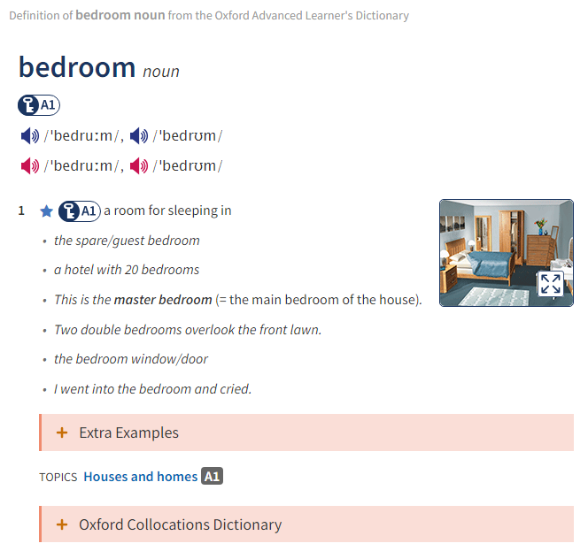

# dict-data

Data from the various dictionaries.

## Oxford Advanced Learners' Dictionary

**For non-commercial use only, this dictionary is copyrighted.**

> Thanks to [wayneclub/Apple-Dictionary](https://github.com/wayneclub/Apple-Dictionary) for the dictionary.

Data from the Oxford Advanced Learners' Dictionary includes pronounciations, images and the actual dictionary in Apple format.

> If you want to use the actual dictionary on your Mac, then see the [original repo](https://github.com/wayneclub/Apple-Dictionary).

See the [official website](https://www.oxfordlearnersdictionaries.com/) for proper use.

### Pronunciations

In the `prons` folder. Inside contains ~50,000 pronunciations in British English IPA and American pronunciations by various people.

### Images

Images complimentary to the dictionary.

For example: `bedroom`

| **Actual dictionary** | **Photo in `img`** |
|---|---|
|   |   |

Contains all aspects of the dictionary, including the Oxford 3000 and 5000.

## Merriam-Webster's Dictionary

**Again, for non-commercial use only, this dictionary is copyrighted.**

> Thanks to [wayneclub/Apple-Dictionary](https://github.com/wayneclub/Apple-Dictionary) for the dictionary.
>
> Again, see the [original repo](https://github.com/wayneclub/Apple-Dictionary) to use the dictionary on your Mac.

A dictionary for American words and pronunciations, in Apple format.
